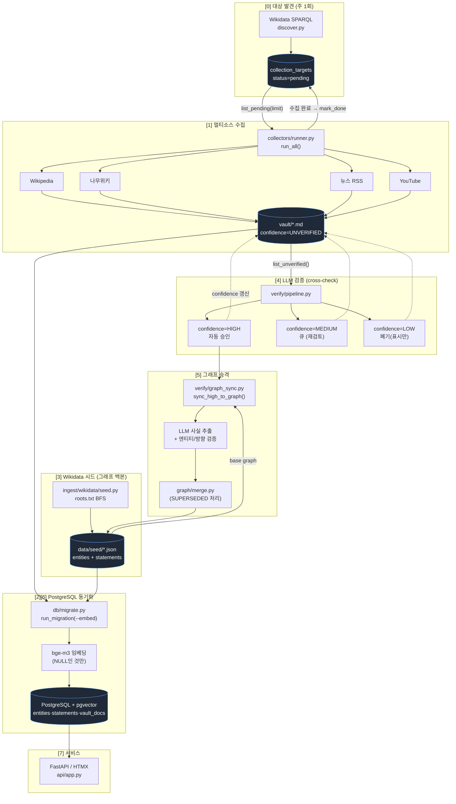
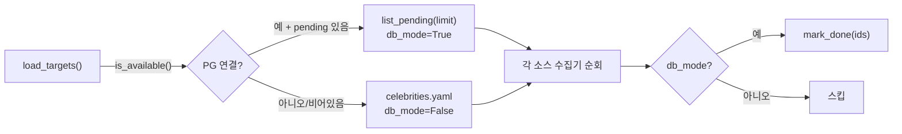
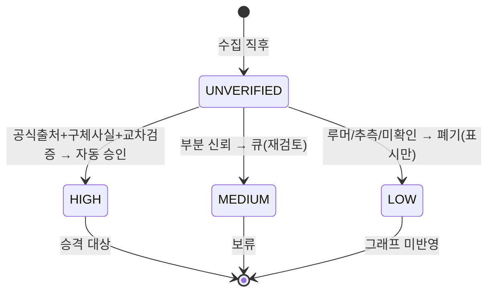
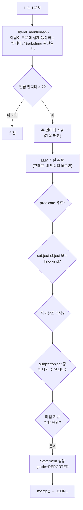

# Veristar — 데이터 파이프라인 아키텍처

> 수집(collect) → PG 적재(sync) → 검증(verify) → 승격(promote) → 동기화(sync)의
> end-to-end 흐름을 한 문서로 정리한다.
> 데이터 모델은 [ontology-schema.md](./ontology-schema.md), 서비스/검색 설계는
> [service-design.md](./service-design.md), 법무·윤리 가드레일은
> [safety-guidelines.md](./safety-guidelines.md)를 본다.
>
> 이 파이프라인의 실제 오케스트레이션은 [`scripts/collect_all.sh`](../scripts/collect_all.sh)다.

---

## 0. 한눈에 — 두 개의 직교 축 (가장 중요)

Veristar를 이해하려면 **서로 다른 두 신뢰 축**을 분리해야 한다. 둘을 섞으면 안 된다.

| 축 | 대상 | 값 | 의미 | 정의 위치 |
|---|---|---|---|---|
| **`confidence`** | vault **문서** | `unverified` → `low` / `medium` / `high` | "이 문서가 **검증 단계를 통과**했는가" (LLM cross-check 결과) | `vault/store.py::ConfidenceLevel` |
| **`grade`** | graph **statement** | `OFFICIAL` / `REPORTED` / `RUMOR` | "이 사실이 **어떤 성격의 출처**에서 나왔는가" (진실 여부 아님) | `ontology/enums.py::Grade` |

- `confidence`는 **수집물의 검증 진행 상태**다. 파이프라인 내부 게이트용.
- `grade`는 **출처의 성격**이다. 서비스/생성 노출 정책의 기준.
- 연결 고리: **`confidence=HIGH` 문서만 승격 대상**이 되고, 승격 시 생성되는 statement는
  LLM 추출 특성상 **항상 `grade=REPORTED`**로 들어간다 (`graph_sync.py::_grade_for`).
  `OFFICIAL` 승격은 사람 검토를 거친 별도 단계다.

> **CLAUDE.md §4 절대 원칙 재확인**
> 1. 출처 없는 사실은 없다.
> 2. 등급은 출처의 성격이지 진실 여부가 아니다.
> 3. 콘텐츠 재료는 `OFFICIAL`만. (`REPORTED`/`RUMOR`는 저장만)
> 5. 민감 정보는 raw vault 저장은 허용, API·생성에서 차단.

---

## 1. 전체 플로우



> 대괄호 번호 `[0]`~`[7]`는 `collect_all.sh`의 실제 실행 순서다.
> `[2]`(수집 직후 즉시 동기화)와 `[6]`(시드·승격 반영 최종 동기화)은 같은 `migrate.py`를
> 두 번 호출하는 것이며, 임베딩은 `embedding IS NULL`인 신규 행만 생성하므로 비용 중복이 없다.

---

## 2. 단계별 상세

### [0] 대상 발견 — `ingest/wikidata/discover.py`

| 항목 | 내용 |
|---|---|
| **목적** | 수집할 한국 연예인/그룹을 **자동 대량 발굴**해 큐에 적재 |
| **입력** | Wikidata WDQS SPARQL (`P27=Q884` 한국 국적 + `P106` 연예 직업) |
| **출력** | `collection_targets` 테이블 (`status=pending`) |
| **주기** | 주 1회 (`collect_all.sh`의 `DISCOVER_DOW`, 기본 일요일) |
| **CLI** | `python -m veristar.ingest.wikidata.discover --occupations singer,actor,entertainer,creator,group` |

- 직업 그룹(가수·배우·예능·크리에이터·그룹)별로 쿼리를 **나눠 실행**해 WDQS 타임아웃·rate-limit을 회피한다 (`sparql.py::OCCUPATION_GROUPS`).
- `require_kowiki=True`: 한국어 위키백과 sitelink가 있는 인물만 (= 유명도 필터). `--no-kowiki-filter`로 해제.
- WDQS 429 응답 시 `Retry-After`를 존중하는 지수 백오프.
- upsert는 **id 충돌 시 status를 보존**한다 — 이미 `done`인 대상이 재발견돼도 다시 `pending`으로 되돌리지 않는다.

### [1] 멀티소스 수집 — `ingest/collectors/runner.py`

| 항목 | 내용 |
|---|---|
| **목적** | 대상별로 여러 소스에서 원문을 긁어 **raw vault**에 Markdown으로 적재 |
| **입력** | `collection_targets` (DB 우선) → `celebrities.yaml` (폴백) |
| **출력** | `vault/articles/*.md`, `vault/sns/*.md` — 모두 `confidence=UNVERIFIED` |
| **CLI** | `python -m veristar.ingest.collectors.runner --sources wikipedia,namuwiki,news --limit 100` |



- 소스별 수집기는 `AbstractCollector`(`collectors/base.py`)를 상속한다: Wikipedia(CC BY-SA 4.0), 나무위키(**CC BY-NC-SA 2.0 KR 라벨 필수**), 뉴스 RSS, YouTube Data API.
- **§4-1 강제**: 모든 문서는 `source_url`을 갖고 저장된다 (출처 없는 적재 거부).
- 민감 정보는 이 단계에서 **차단하지 않는다** — `sensitive` 플래그만 붙여 vault에 저장하고, 노출 차단은 서비스 레이어가 담당 (§4-5).
- DB 모드일 때만 처리한 대상을 `done`으로 마킹한다. YAML 폴백 모드는 상태 추적이 없다.
- ⚠️ 나무위키는 CSR(client-side rendering)이라 headless browser 없이는 본문을 못 받고 TOC 구조만 수집된다.

### [3] Wikidata 시드 — `ingest/wikidata/seed.py`

| 항목 | 내용 |
|---|---|
| **목적** | `roots.txt`의 루트 QID에서 BFS로 **그래프 백본**(검증된 엔티티·관계)을 구축 |
| **입력** | `config/roots.txt` (Wikidata 루트 QID 목록) |
| **출력** | `data/seed/wikidata_seed.json` (entities + statements, JSONL) |
| **CLI** | `python -m veristar.ingest.wikidata.seed --roots-file config/roots.txt --max 120` |

- 수집(vault)과 **독립적인 경로**다. vault는 "원문 텍스트", 시드는 "구조화된 그래프 골격"으로 역할이 다르다.
- 이 JSONL이 승격([5])의 **base graph**가 되고, 동기화([2][6])의 그래프 소스가 된다.
- 증분 병합·`SUPERSEDED` 처리는 `graph/merge.py`가 담당 (`docs/plans/m2b-scope-merge-plan.md`).

### [4] LLM 검증 — `verify/pipeline.py`

| 항목 | 내용 |
|---|---|
| **목적** | `UNVERIFIED` vault 문서를 LLM cross-check로 평가해 신뢰도 등급 부여 |
| **입력** | `vault.list_unverified()` |
| **출력** | 각 문서의 `confidence` 갱신 + `sensitive` 재평가 (frontmatter 재기록) |
| **LLM** | Ollama `qwen3:14b` (로컬, `generate/llm.py::chat`) |
| **CLI** | `python -m veristar.verify.pipeline --vault vault/` |

LLM은 **공식 출처 언급 / 구체적 날짜·수치 / 단정 vs 추측 비율**을 보고 JSON으로 답한다:

```json
{"confidence": "HIGH"|"MEDIUM"|"LOW", "sensitive": true|false, "reason": "..."}
```



- **HIGH만 자동 승인**되어 다음 단계(승격)로 간다. MEDIUM은 큐에 남고, LOW는 표시만 하고 폐기(파일은 보존, 그래프 미반영).
- LLM이 `sensitive=true`로 판단하면 문서를 재저장해 플래그를 갱신한다.
- LLM 오류/JSON 파싱 실패 시 해당 문서는 `errors`로 집계하고 등급을 바꾸지 않는다 (안전한 no-op).

### [5] 그래프 승격 — `verify/graph_sync.py`

| 항목 | 내용 |
|---|---|
| **목적** | `confidence=HIGH` 문서에서 **그래프 사실(statement)**을 추출해 JSONL 그래프에 병합 |
| **입력** | vault HIGH 문서 + base graph (`wikidata_seed.json`) |
| **출력** | 새 `Source` + `Statement`(항상 `grade=REPORTED`) → 병합된 JSONL |
| **CLI** | `python -m veristar.verify.graph_sync --vault vault/ --seed data/seed/wikidata_seed.json` |

이 단계는 **환각(hallucination)을 막는 다중 가드**가 핵심이다:



- **벡터 유사도 대신 리터럴 부분 문자열 매칭**을 쓴다 — K-pop 문맥에서 "한", "뷔" 같은 짧은 이름의 과매칭(false-positive)을 막기 위해. 2자 이하 이름은 토큰 경계로 둘러싸인 경우만 허용.
- subject/object는 **반드시 그래프에 이미 있는 엔티티 id**여야 한다 (새 엔티티를 LLM이 만들어내지 못함).
- subject 또는 object 중 하나는 **반드시 문서 주 엔티티**여야 한다 (문서 주제와 무관한 사실 차단).
- `_is_valid_direction`: 엔티티 타입 기반 방향 검증 (예: `memberOf`는 Person→Group, 반대 방향이면 거부).
- 추출 사실은 **항상 `REPORTED`** (`_grade_for`). source_type만 출처에 따라 매핑 (wikipedia→`WIKIDATA_VERIFIED`, namuwiki→`COMMUNITY_OR_ANON`, news→`PRESS` 등).
- `merge()`가 증분 병합·`SUPERSEDED`를 처리하므로 재실행해도 그래프가 오염되지 않는다.

### [2][6] PostgreSQL 동기화 — `db/migrate.py`

| 항목 | 내용 |
|---|---|
| **목적** | JSONL 그래프 + Markdown vault → **PostgreSQL + pgvector**로 적재 (서비스 백엔드) |
| **입력** | `wikidata_seed.json` + `vault/*.md` |
| **출력** | `entities` / `sources` / `statements` / `vault_docs` 테이블 + 임베딩 |
| **임베딩** | `bge-m3` (1024-dim, Ollama) — `embedding IS NULL`인 행만 생성 |
| **CLI** | `python -m veristar.db.migrate --seed ... --vault ... --embed` |

- 모든 적재는 **`ON CONFLICT ... DO UPDATE` upsert** — 재실행 안전(idempotent).
- 원본 JSONL·Markdown 파일은 **삭제하지 않는다** (백업·InMemory 폴백 역할 유지).
- **`[2]` 수집 직후 즉시 동기화**: 새로 긁은 vault 문서를 API·벡터검색에 바로 반영. (사용자 요청: "수집 완료되면 PG 동기화 바로")
- **`[6]` 최종 동기화**: 시드 갱신([3]) + 그래프 승격([5])분까지 반영.
- 임베딩은 NULL인 신규 행만 처리하므로 `[2]`와 `[6]`이 같은 문서를 두 번 임베딩하지 않는다.
- ⚠️ `bge-m3` 사용 이유: `nomic-embed-text`는 한국어 변별력이 없어(무관한 두 한국어 문장이 동일 벡터 반환) 검색이 오작동했다. 1024-dim `bge-m3`로 교체.

### [7] 서비스 — `api/app.py`

- PostgreSQL 연결 가능 시 `PostgreSQLGraphRepository`, 불가 시 `InMemoryGraphRepository`(JSONL) 자동 폴백.
- 서비스 레이어가 **노출 정책**을 강제한다: `OFFICIAL`만 콘텐츠 생성 재료, `sensitive=true`는 API·생성에서 차단 (§4-3, §4-5).
- 수집/동기화 후 서버가 떠 있으면 `scripts/server.sh restart`로 핫 리로드.

---

## 3. 데이터가 흐르며 바뀌는 상태

| 위치 | 식별자 | 상태/등급 | 누가 바꾸나 |
|---|---|---|---|
| `collection_targets` | `status` | `pending` → `collecting` → `done`/`failed` | discover([0]) 적재, runner([1]) 완료 마킹 |
| `vault/*.md` | `confidence` | `unverified` → `high`/`medium`/`low` | verify([4]) |
| `vault/*.md` | `sensitive` | `false` ↔ `true` | 수집([1]) 초기값, verify([4]) 재평가 |
| `statements` | `grade` | `REPORTED` (vault 출신) / `OFFICIAL`·`RUMOR` (시드·수동) | promote([5]), 사람 검토 |
| `statements` | `status` | `ACTIVE` → `SUPERSEDED` | merge([5]) |

---

## 4. 3-레이어 매핑 (CLAUDE.md §3과의 대응)

| 레이어 | 단계 | 저장소 |
|---|---|---|
| **L1 raw vault** | [1] 수집 | `vault/*.md` (Obsidian Markdown) |
| **L2 knowledge graph** | [3] 시드 · [4] 검증 · [5] 승격 · [2][6] 동기화 | JSONL → PostgreSQL + pgvector |
| **L3 service API** | [7] 서비스 | FastAPI / HTMX |

---

## 5. 수동 실행 — 단계별 명령

```bash
# [0] 대상 발견 (주 1회)
python -m veristar.ingest.wikidata.discover --occupations singer,actor,entertainer,creator,group

# [1] 멀티소스 수집 (pending 100건)
python -m veristar.ingest.collectors.runner --sources wikipedia,namuwiki,news --limit 100

# [3] Wikidata 시드 BFS
python -m veristar.ingest.wikidata.seed --roots-file config/roots.txt --max 120 --allow-unreferenced

# [4] LLM 검증
python -m veristar.verify.pipeline --vault vault/

# [5] HIGH → 그래프 승격
python -m veristar.verify.graph_sync --vault vault/ --seed data/seed/wikidata_seed.json

# [2][6] PostgreSQL 동기화 (+ 임베딩)
python -m veristar.db.migrate --seed data/seed/wikidata_seed.json --vault vault/ --embed

# 전체 자동 (cron)
bash scripts/collect_all.sh
```

---

## 6. 관련 문서

- [ontology-schema.md](./ontology-schema.md) — 엔티티·관계·출처·vault 데이터 모델
- [service-design.md](./service-design.md) — 검색·Q&A·엔티티 링킹·기술 스택
- [safety-guidelines.md](./safety-guidelines.md) — 법무·윤리 가드레일
- [`scripts/collect_all.sh`](../scripts/collect_all.sh) — 이 파이프라인의 실제 오케스트레이션
